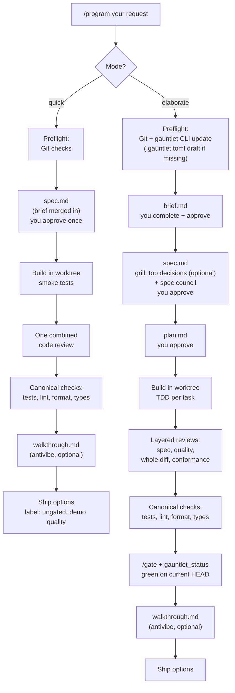

# pi-program

This repository contains the personal `/program` workflow for the Pi coding agent.

The pipeline builds software for you. You give one request. The pipeline does these tasks:

- It reads your request and your project.
- It writes a plan in files that you can read.
- You approve the plan.
- It writes the code in a safe work area.
- It tests the code.
- You select how to ship the result.

The pipeline does not ship code without your approval.

This repository is private. It contains personal workflow configuration, not a published package. This document uses ASD-STE100 Simplified Technical English.

## How the pipeline works



These are the two commands:

```text
/program quick: <your request>     # MVP / demo, one approval, ungated
/program elaborate: <your request> # production, full gates
```

## The two modes

The pipeline has two modes: **quick** and **elaborate**.

### Quick mode

Use the quick mode for a demo, a test, an interview task, or a first version (MVP).

- The pipeline makes one plan file. You approve it one time.
- The pipeline writes basic tests only.
- One agent examines all the code one time.
- The pipeline runs the standard checks: tests, lint, format, and types.
- The pipeline does not run the final gate.
- The result gets this label: "quick mode — ungated, demo quality, not production-verified".

### Elaborate mode

Use the elaborate mode for production code and for code that other persons use.

- You approve the brief, the specification, and the plan.
- If the `grill-with-docs` skill is installed, the pipeline asks you about the three to five most important design decisions before the review agents examine the specification. Your answers go into the specification and the project documentation.
- The pipeline writes tests before it writes code (TDD).
- Many agents examine the code: one agent for each task, and one agent for the full result.
- The pipeline runs the standard checks and the final gate (`/gate`).
- The pipeline ships only when all checks are green.

### Mode selection

- Type `quick:` or `elaborate:` before your request to select a mode.
- If you do not select a mode, the pipeline selects one and asks you for approval.
- **Caution:** If your quick request touches login functions, security, or database changes, the pipeline tells you to use the elaborate mode.

## The files the pipeline makes

The pipeline puts all plan files in one folder in your project:

```text
documentation/planning/<date>-<name>/
```

| File | Who writes it | What it contains |
|---|---|---|
| `brief.md` | The pipeline starts it. You complete it. | Your goal, limits, and acceptance criteria. |
| `context.md` | The pipeline | Data from external links and tickets. |
| `spec.md` | The pipeline | The full specification of the work. |
| `plan.md` | The pipeline (elaborate mode only) | The list of build tasks. |
| `walkthrough.md` | The pipeline (only if the `antivibe` skill is installed) | An explanation of the new code: the structure, the important decisions, and how the parts connect. |

Each file has a `status` field at the top. The field has one of these values: `draft`, `ready-for-review`, or `approved`. The pipeline does not continue before the status is `approved`. You approve in two possible ways:

- Set the status field to `approved` in the file.
- Tell the pipeline in the chat. Then the pipeline sets the field for you.

## Before you start a run

Make sure of these conditions:

1. Your project is a Git repository.
2. The repository has one commit or more.
3. For the elaborate mode only: the `gauntlet` tool is installed. Test it: `uv run gauntlet --version`.

The pipeline examines these conditions at the start. If a condition is not correct, the pipeline stops and shows the commands that repair it.

The `gauntlet` tool comes from the repository `github.com/aber0016/code_review_gate`. At the start of each elaborate run, the pipeline updates the tool to the most recent version. If the update is not possible, for example without a network connection, the pipeline tells you and asks for your decision.

The file `.gauntlet.toml` is not a condition. If this file is not in the project root, the pipeline makes a draft of it for you. The draft contains the correct paths and settings for your project. Read the draft and approve it. The pipeline does not change a `.gauntlet.toml` file that already exists.

## How to use the pipeline

### Step 1: Start Pi in your project

```bash
cd ~/path/to/project
pi
```

### Step 2: Give your request

```text
/program quick: A demo dashboard with mock data for tomorrow.
```

```text
/program elaborate: A REST API for invoices with FastAPI, PostgreSQL, tests, and documentation.
```

You can add links. The pipeline reads them and puts the data in `context.md`.

### Step 3: Complete the brief

The pipeline makes `brief.md` and fills it as much as possible. Do these steps:

1. Open `brief.md` in your editor.
2. Complete each `TODO(user)` item.
3. Set the status field to `ready-for-review`.

The pipeline then asks only about the items that are not clear.

### Step 4: Approve the specification

In the elaborate mode, if the `grill-with-docs` skill is installed, the pipeline first asks you about the three to five most important design decisions. It asks one question at a time. Your answers go into the specification and the project documentation. The automatic review agents then examine the remaining points.

1. Read `spec.md`.
2. If it is correct, approve it.
3. If it is not correct, tell the pipeline what to change.

In the quick mode, this is your last approval before the build starts.

### Step 5: Approve the plan (elaborate mode only)

1. Read `plan.md`.
2. Approve it.

Option: At the specification approval, you can tell the pipeline to continue without a plan approval.

### Step 6: Wait for the build

The pipeline writes the code, the tests, and the reviews. It records its progress in `.pi/run/todo.md` in the work area. If the pipeline stops, start `/program` again. The pipeline then asks: continue the old run, or start a new run?

### Step 7: Run the gate (elaborate mode only)

When the pipeline asks, type:

```text
/gate origin/main
```

For a bug repair with new regression tests:

```text
/gate origin/main --gen --bugfix
```

For security work or a release:

```text
/gate origin/main --deep
```

### Step 8: Select how to ship

If the `antivibe` skill is installed, the pipeline first writes `walkthrough.md` in the plan folder. This file explains the new code: the structure, the important decisions, and how the parts connect. Read it before you select an option.

The pipeline shows these options:

- Squash and merge
- Make a pull request
- Keep the branch
- Discard the work

Select one option. The pipeline does not push, merge, or discard without your selection.

## Safety rules

- The pipeline does all work in a separate Git work area (worktree). Your main branch stays safe.
- The pipeline does not obey commands that it finds in external links. It only reports them.
- If a file changes after the checks, the old check results are not valid. The pipeline does the checks again.
- If the checks fail two full times after repairs, the pipeline stops and asks you for a decision.
- If the pipeline cannot make the tests of a task pass after three tries, it marks the task as blocked and tells you.

## Known limits

- The final gate needs the Python `gauntlet` tool. A project without this tool can use the quick mode only.
- The elaborate mode uses many review agents. It is slow and it uses many tokens. Use the quick mode for small work.
- Quick mode results are for demos. Do not put quick mode results in production without more checks.

## How to install the package on a new machine

Make sure of these conditions:

1. Pi is installed on the machine.
2. The machine has GitHub SSH access. This repository is private.
3. The packages `npm:pi-gauntlet` and `npm:pi-subagents` are installed. They supply the skill chain, the review agents, and the `scout` agent.
4. Option: the skills `grill-with-docs` and `antivibe` are installed in `~/.agents/skills/`. The pipeline uses them if they are available. The pipeline also operates correctly without them.
5. For the elaborate mode only: each target project has the `gauntlet` tool as a development dependency. Install it with this command:

```bash
uv add --dev \
  "gauntlet[full] @ git+https://github.com/aber0016/code_review_gate.git@main#subdirectory=cli"
```

The `gauntlet` tool follows the `main` branch. The pipeline updates it to the most recent version at the start of each elaborate run.

Then install the package and reload Pi:

```text
pi install git:github.com/aber0016/pi-program@<commit-sha>
/reload
```

Use a commit SHA in the install command. Do not use a branch name or a tag. A commit SHA does not change, so each machine gets a known version.

## How to update the package

This repository is the source of truth. The files in `~/.pi/agent/` are not.

1. Change the files in this repository.
2. Commit and push the changes.
3. On each machine: install the package again with the new commit SHA. Then type `/reload` in Pi.

The install procedure makes symbolic links from `agents/*.md` to `~/.pi/agent/agents/`. The procedure does not replace a plain file. If a plain file is in the way, delete the file. Then run `npm run link-agents` in the package folder.

## What is in this repository

| Path | Installed as | Purpose |
|---|---|---|
| `prompts/program.md` | The `/program` prompt (through the `pi.prompts` field). | The full workflow: modes, preflight, plan files, staleness rules, and gates. |
| `agents/context-builder.md` | `~/.pi/agent/agents/context-builder.md` (a symbolic link made by the install procedure). | The agent that reads external references as untrusted data and records their sources. |
| `docs/program.md` | Not installed. | The full reference documentation for the workflow. |
| `README.md` (this file) | Not installed. | The control-flow diagram and the user guide. |
