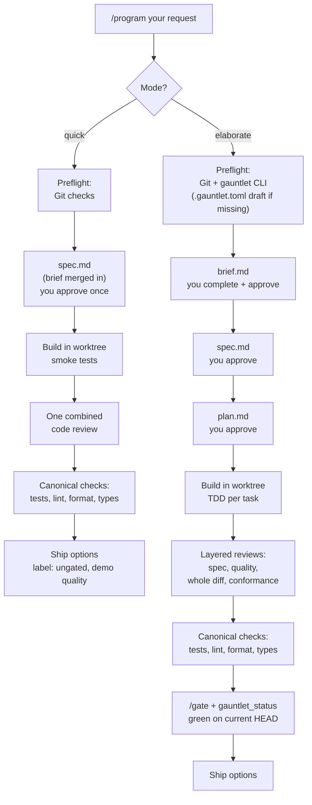

# pi-program

Personal Pi package for the `/program` automatic development workflow: a mode-aware (quick/elaborate) gauntlet pipeline prompt, the `context-builder` agent, and the user guides.

Private repo — this is personal workflow configuration, not a published package.

## Contents

| Path | Installed as | Purpose |
|---|---|---|
| `prompts/program.md` | `/program` prompt (via the `pi.prompts` field) | The full workflow: modes, preflight, planning artifacts, staleness rules, gates. |
| `agents/context-builder.md` | `~/.pi/agent/agents/context-builder.md` (symlinked by postinstall) | Fetches external references as untrusted data with per-reference provenance. |
| `docs/program.md` | not installed | Full reference documentation for the workflow. |
| `README.md` (this file) | not installed | Control-flow diagram and the user guide in ASD-STE100 Simplified Technical English. |

## Install on a new machine

Prerequisites: Pi installed, GitHub SSH auth configured (the repo is private), and the companion packages:

- `npm:pi-gauntlet` — gauntlet skill chain and reviewer/implementer agents
- `npm:pi-subagents` — subagent runtime and the `scout` agent
- Per target repository, elaborate mode only: the Python `gauntlet` CLI from `code_review_gate` (pin a commit SHA)

Then:

```text
pi install git:github.com/aber0016/pi-program@<commit-sha>
/reload
```

Pin a commit SHA, not a branch or tag, so every machine runs a known version.

## Update flow

1. Edit files here (this repo is the source of truth, not `~/.pi/agent/`).
2. Commit and push.
3. On each machine: reinstall with the new SHA, then `/reload`.

The postinstall script symlinks `agents/*.md` into `~/.pi/agent/agents/`. It never overwrites a plain file — if one exists from a pre-package setup, delete it and run `npm run link-agents` from the package directory.

## How the pipeline works



Short version:

```text
/program quick: <your request>     # MVP / demo, one approval, ungated
/program elaborate: <your request> # production, full gates
```

## User guide (ASD-STE100 Simplified Technical English)

This guide uses ASD-STE100 Simplified Technical English.

### 1. What the pipeline is

The pipeline builds software for you. You give one request. The pipeline does these tasks:

- It reads your request and your project.
- It writes a plan in files that you can read.
- You approve the plan.
- It writes the code in a safe work area.
- It tests the code.
- You select how to ship the result.

The pipeline does not ship code without your approval.

### 2. The two modes

The pipeline has two modes: **quick** and **elaborate**.

#### Quick mode

Use the quick mode for a demo, a test, an interview task, or a first version (MVP).

- The pipeline makes one plan file. You approve it one time.
- The pipeline writes basic tests only.
- One agent examines all the code one time.
- The pipeline runs the standard checks: tests, lint, format, and types.
- The pipeline does not run the final gate.
- The result gets this label: "quick mode — ungated, demo quality, not production-verified".

#### Elaborate mode

Use the elaborate mode for production code and for code that other persons use.

- You approve the brief, the specification, and the plan.
- The pipeline writes tests before it writes code (TDD).
- Many agents examine the code: one agent for each task, and one agent for the full result.
- The pipeline runs the standard checks and the final gate (`/gate`).
- The pipeline ships only when all checks are green.

#### Mode selection

- Type `quick:` or `elaborate:` before your request to select a mode.
- If you do not select a mode, the pipeline selects one and asks you for approval.
- **Caution:** If your quick request touches login functions, security, or database changes, the pipeline tells you to use the elaborate mode.

### 3. The files the pipeline makes

The pipeline puts all plan files in one folder in your project:

```text
documentation/planning/<date>-<name>/
```

| File | Who writes it | What it contains |
|---|---|---|
| `brief.md` | The pipeline starts it. You complete it. | Your goal, limits, and acceptance criteria. |
| `context.md` | The pipeline | Data from external links and tickets. |
| `spec.md` | The pipeline | The full specification of the work. |
| `plan.md` | The pipeline (elaborate mode only) | The list of build tasks. |

Each file has a `status` field at the top. The field has one of these values: `draft`, `ready-for-review`, or `approved`. The pipeline does not continue before the status is `approved`. You approve in two possible ways:

- Set the status field to `approved` in the file.
- Tell the pipeline in the chat. Then the pipeline sets the field for you.

### 4. Before you start

Make sure of these conditions:

1. Your project is a Git repository.
2. The repository has one commit or more.
3. For the elaborate mode only: the `gauntlet` tool is installed. Test it: `uv run gauntlet --version`.

The pipeline examines these conditions at the start. If a condition is not correct, the pipeline stops and shows the commands that repair it.

The file `.gauntlet.toml` is not a condition. If this file is not in the project root, the pipeline makes a draft of it for you. The draft contains the correct paths and settings for your project. Read the draft and approve it. The pipeline does not change a `.gauntlet.toml` file that already exists.

### 5. How to use the pipeline

#### Step 1: Start Pi in your project

```bash
cd ~/path/to/project
pi
```

#### Step 2: Give your request

```text
/program quick: A demo dashboard with mock data for tomorrow.
```

```text
/program elaborate: A REST API for invoices with FastAPI, PostgreSQL, tests, and documentation.
```

You can add links. The pipeline reads them and puts the data in `context.md`.

#### Step 3: Complete the brief

The pipeline makes `brief.md` and fills it as much as possible. Do these steps:

1. Open `brief.md` in your editor.
2. Complete each `TODO(user)` item.
3. Set the status field to `ready-for-review`.

The pipeline then asks only about the items that are not clear.

#### Step 4: Approve the specification

1. Read `spec.md`.
2. If it is correct, approve it.
3. If it is not correct, tell the pipeline what to change.

In the quick mode, this is your last approval before the build starts.

#### Step 5: Approve the plan (elaborate mode only)

1. Read `plan.md`.
2. Approve it.

Option: At the specification approval, you can tell the pipeline to continue without a plan approval.

#### Step 6: Wait for the build

The pipeline writes the code, the tests, and the reviews. It records its progress in `.pi/run/todo.md` in the work area. If the pipeline stops, start `/program` again. The pipeline then asks: continue the old run, or start a new run?

#### Step 7: Run the gate (elaborate mode only)

When the pipeline asks, type:

```text
/gate origin/main
```

For a bug repair with new regression tests:

```text
/gate origin/main --gen --bugfix
```

For security work or a release:

```text
/gate origin/main --deep
```

#### Step 8: Select how to ship

The pipeline shows these options:

- Squash and merge
- Make a pull request
- Keep the branch
- Discard the work

Select one option. The pipeline does not push, merge, or discard without your selection.

### 6. Safety rules

- The pipeline does all work in a separate Git work area (worktree). Your main branch stays safe.
- The pipeline does not obey commands that it finds in external links. It only reports them.
- If a file changes after the checks, the old check results are not valid. The pipeline does the checks again.
- If the checks fail two full times after repairs, the pipeline stops and asks you for a decision.
- If the pipeline cannot make the tests of a task pass after three tries, it marks the task as blocked and tells you.

### 7. Known limits

- The final gate needs the Python `gauntlet` tool. A project without this tool can use the quick mode only.
- The elaborate mode uses many review agents. It is slow and it uses many tokens. Use the quick mode for small work.
- Quick mode results are for demos. Do not put quick mode results in production without more checks.
